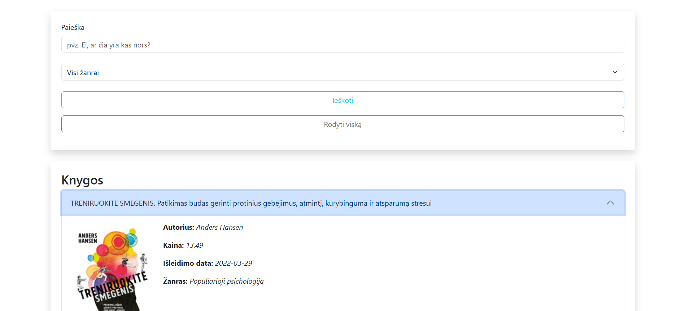

# 📚 Book Catalog

A responsive and clean web app that fetches books and genres from two separate APIs. Built with vanilla JavaScript and styled entirely using **Bootstrap**—no custom CSS, except one line for image width (just to be honest 😉).

## 🔍 Features

- Fetches books from an external API
- Fetches genres from a separate API
- Search by:
  - Book title
  - Author
  - Genre (via input or clicking on listed genres)
- One-click reset to view all books again
- Adaptive design for all screen sizes
- Minimalist layout with Bootstrap components

## 🌐 Live Demo

[View the Book Catalog on GitHub Pages](https://rainydeville.github.io/book-catalog-JS/)

## 📸 Screenshot



## 🧰 Tech Stack

- HTML5
- JavaScript (ES6+)
- [Bootstrap 5](https://getbootstrap.com/) (for layout, styling, responsiveness)
- [Books API](https://in3.dev/knygos/)
- [Genres API](https://in3.dev/knygos/types/)

## 🚀 Getting Started

To run it locally:

```bash
git clone https://rainydeville.github.io/book-catalog-JS.git
cd book-catalog-JS
---

✨ Author
Rainy — Front-end developer & Bootstrap wrangler